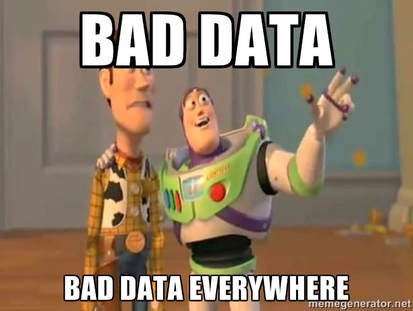
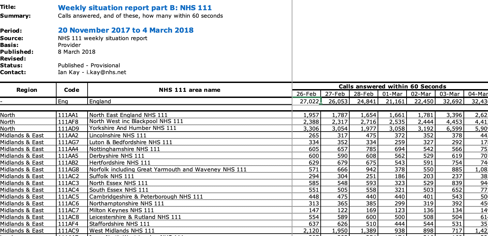

```{r setup, include=FALSE}

library(tidyverse)
library(lubridate)
options(htmltools.dir.version = FALSE)
```


## What we will cover today
Session is aimed at advanced beginners and I will assume some familiarity with R and the tidyverse. 

--
### Coding along

No need to code along, but if you want to, here is what you need: 


- `tidyverse`, `here` and `lubridate` packages installed and loaded.
- data from github repo

--
We will focus on two packages

- Reshaping data - tidyr 
- Joining data sets together - dplyr package
---
class: middle, center

## What's your favourite R package?
Please go to www.menti.com and enter the code 44 00 69 5


---

## Packages in R


The first time you use it you need to install the package. 

```r
install.packages("tidyverse")
```

Load the package

```r
library(tidyverse)
library(lubridate)

```


---

## The pipe

Simplifying R code with pipes (%>%)


nested statement
```r
leave_house(get_dressed(get_out_of_bed(wake_up(me))))
```
VS

piped statement
```r
me %>% 
  wake_up() %>% 
  get_out_of_bed() %>% 
  get_dressed() %>% 
  leave_house()
```

**Keyboard shortcut ctrl+shift +m**


---
class: center, middle




---

## Does this look familiar? 
 


--

`r emo::ji("family_man_woman_girl") ` `r emo::ji("smile") `


--

 `r emo::ji("computer") ` `r emo::ji("cry") ` 


---
class: 

## Tidy data

Data comes in all kinds of shapes and forms. 

1. Each variable forms a column.
2. Each observation forms a row.
3. Each cell contains a single value.


## tidyr package

Tools to help to create tidy data, where each column is a variable, each row is an observation, and each cell contains a single value. 
---

- `pivot_longer` - you will end up with more rows


- `pivot_wider` - you will end up with more variables


---
class: 

## Sitrep data

Downloaded data from [NHSE website](https://www.england.nhs.uk/statistics/statistical-work-areas/winter-daily-sitreps/winter-daily-sitrep-2017-18-data/) and saved in R data format. 


```{r}
sitrep <- readRDS(here::here('data', 'sitrep.rds')) # all calls
sitrep_60sec <- readRDS(here::here('data', 'sitrep_60sec.rds')) # calls answered within 60sec
```


```{r}
head(sitrep)
```

---
class: 
## Potential analysis

Plot the total number of calls over time

Create 7 day rolling average

Summarise by region

--

**Very difficult with the current set up**

---
class: middle

## What is a sensible next step?

1. make the data longer
1. make the data wider
1. nah don't bother, it is fine as it is


	
---
class: left, middle

## Let's make the data long

```{r, eval=FALSE}
sitrep_long <- sitrep %>% 
  pivot_longer(
    cols=-c(NHS_111_area_name, year), #<<
    names_to='day_month',
    values_to='calls')
```


---
class: left, middle

## Let's make the data long

```{r, eval=FALSE}
sitrep_long <- sitrep %>% 
  pivot_longer(
    cols=-c(NHS_111_area_name, year), 
    names_to='day_month', #<<
    values_to='calls')
```


---
class: left, middle

## Let's make the data long

```{r}
sitrep_long <- sitrep %>% 
  pivot_longer(
    cols=-c(NHS_111_area_name, year), 
    names_to='day_month',
    values_to='calls')  #<<
```

---
class: middle

Our data is long and easier to work with! 

```{r}
head(sitrep_long)
```

---

Fix the date
```{r}
sitrep_long <- sitrep_long %>% 
  mutate(day_month=str_replace(day_month, '_', '-'), 
         date=paste(year, day_month, sep='-'), 
         date=ydm(date)) %>% 
  select(-year, -day_month)

head(sitrep_long)
```

---
Calculate total calls by region
```{r}
sitrep_calls_by_region <- sitrep_long %>% 
  group_by(NHS_111_area_name) %>% 
  summarise(total_calls_region=sum(calls)) 


head(sitrep_calls_by_region)
```


---

```{r}
sitrep_long %>% 
  group_by(date) %>% 
  summarise(total_calls_region=sum(calls, na.rm=TRUE)) %>% 
  ggplot(aes(x=date, y=total_calls_region)) + geom_point(colour='purple') + 
  theme_minimal() + scale_x_date(date_labels = '%Y-%m-%d') + scale_y_continuous(limits = c(0, NA), labels=scales::comma) + labs(x='', y='', title='Daily calls to NHS 111')
```

---

You can also go back to a wide format eg after calculating the cumulative sum of calls. 

```{r}
sitrep_wide <- sitrep_long %>% 
  group_by(NHS_111_area_name) %>%
  arrange(date) %>% 
  mutate(cum_call=cumsum(calls)) %>% 
  pivot_wider(id_cols = c(NHS_111_area_name), values_from=cum_call, names_from=date)

head(sitrep_wide)
```

---

The `who` data set from the tidyr package shows a slightly more complicated example. 

```{r, include=TRUE}
data('who')
tail(who)
```
---

# Structure of variable names

```{r, echo=FALSE}

tail(names(who))
```


new or newrel

method of diagnosis (rel = relapse, sn = negative pulmonary smear, sp = positive pulmonary smear, ep = extrapulmonary) 

gender (f = female, m = male) 

age group (014 = 0-14 yrs of age, 1524 = 15-24 years of age, etc.)


---

```{r, eval=FALSE, include=TRUE}

who %>% pivot_longer(
  cols = new_sp_m014:newrel_f65,#<<
  names_to = c("diagnosis", "gender", "age_group"), 
  names_pattern = "new_?(.*)_(.)(.*)",
  values_to = "count"
)
```

---

```{r, eval=FALSE}

who %>% pivot_longer(
  cols = new_sp_m014:newrel_f65,
  names_to = c("diagnosis", "gender", "age_group"), #<<
  names_pattern = "new_?(.*)_(.)(.*)",
  values_to = "count"
)
```
---
```{r, eval=FALSE}

who %>% pivot_longer(
  cols = new_sp_m014:newrel_f65,
  names_to = c("diagnosis", "gender", "age_group"), 
  names_pattern = "new_?(.*)_(.)(.*)", #<<
  values_to = "count"
)
```

---

```{r, eval=FALSE}
who %>% pivot_longer(
  cols = new_sp_m014:newrel_f65,
  names_to = c("diagnosis", "gender", "age_group"), 
  names_pattern = "new_?(.*)_(.)(.*)", 
  values_to = "count" #<<
)
```
---
class: top
background-image: url(https://www.memesmonkey.com/images/memesmonkey/e2/e24982369a32d97b56f206d303066b70.jpeg)
background-position: bottom
background-size: 800px 400px

## Joining data sets

**Do I want to add more rows or more columns? **

---
background-image: url(https://miro.medium.com/max/1400/1*uG1vjoSQj7gMm8craCj2xA.png)
background-position: bottom
background-size: 800px 400px

**More rows? Great!**

`bind_rows()` - use to combine different datasets eg monthly gp appointments
Columns with the same variable names will be stacked but check for changes to variable names.


---
More columns? OK this is slightly more complicated but dplyr will be your friend. 

`bind_cols()` - I rarely use it - doesn't respect the order of the variables


Instead we can use join functions from `dplyr`. If you know sql, this is your lucky day as the syntax is very similar. 


---
## Mutating joins

A mutating join allows you to combine variables from two tables. It first matches observations by their keys, then copies across variables from one table to the other.

- inner_join(x,y) only keeps observations where in both
- full_join(x,y) keeps all observations even if not in both
- left_join(x,y) keeps all observations in x
- right_join(x,y) keeps all observations in y


---

## Filtering joins

Filtering joins match observations in the same way as mutating joins, but affect the observations, not the variables.

- anti_join(x,y) drops all observations in x that have a match in y
- semi_join(x,y) keeps all observations in x that have a match in y


---
class: top
background-size: cover
background-image: url(https://media.makeameme.org/created/danger-danger-everwhere.jpg)


---
Let's revisit the NHS 111 data from before. 

```{r, echo=FALSE}

sitrep_60sec_long <- sitrep_60sec %>% 
  pivot_longer(-c(NHS_111_area_name, year),
               names_to='day_month', 
               values_to='calls') %>% 
mutate(day_month=str_replace(day_month, '_', '-'), date=paste(year, day_month, sep='-'), date=ydm(date)) %>% 
  rename(date_60sec=date)

```

### All calls
```{r, echo=FALSE}
head(sitrep_60sec_long)
```

### Calls answered within 60 seconds
```{r, echo=FALSE}
head(sitrep_long)
```


---

Mentimeter time!

I want to combine the two data sets using the region name and the date. I want to keep all observations, even ones that do not exist in both data sets. Which type of join should I use? 


---
class: middle
```{r}
sitrep_full <- full_join(sitrep_long,
                         sitrep_60sec_long,
                         by=c('NHS_111_area_name', 'date'='date_60sec'),
                         suffix=c('_all','_60sec')
                         )
```


Worth noting 

- you can add a suffix for any variables that appear in both datasets
- you can join on multiple variables
- the variables you merge on do not need to have the same name


